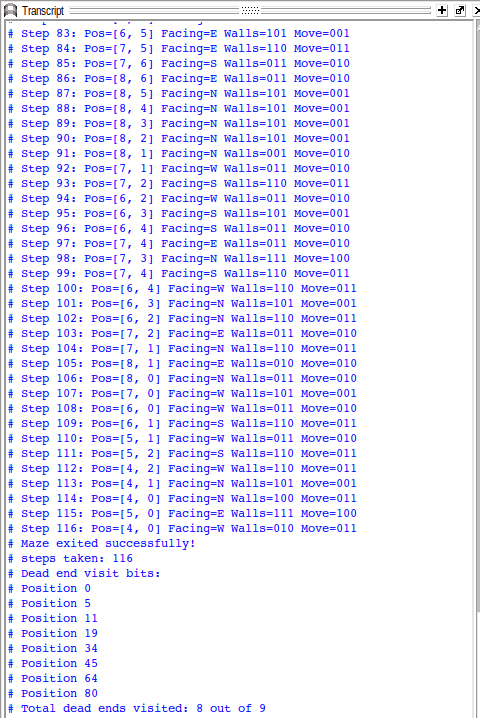
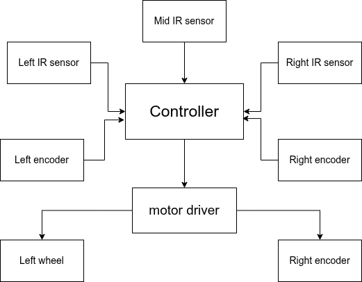

# The FINAL boss!

After configuring all our sensors and generating PWM signals, it's the right time to finally start building on the main algorithm that is supposed to be solving the maze! The journey is gonna be amazing, we promise!

There are quite a lot of tried and tested methods to solve a maze. To name a few, we have simple wall-following algorithms, search-based algorithms like Depth-First Search and Breadth-First-Search, path-planning based ones like A* or Djikstra's and the ones we like the most- Flood fill and Tremaux's algorithm. 

But here's the catch, we used none of them (LOL). Lemme be frank, we were first awed by the flood fill algorithm and made the arrays and wrote up the logic for updating values in the arrays as the bot traversed the maze, but it was highly expensive computationally and competition deadline constraints left us with little time for spending long hours on optimisation.

*(it's highly encouraged to explore all these algorithms and choose the one that works for you. For references, we'll add the ones we studied them from)*

So the plan changed. Our target now was to write a simple yet efficient algorithm for our bot to solve the maze. We had another constraint up our sleeves- the competition rules required us not to take the shortest path but to build an algorithm that visits as many of the dead ends as possible (8 did we manage to visit out the 9) and complete the whole exploration in a limit of 200 steps. The method we chose to achieve that was a simple rule: we receive data from the IR sensors about the presence of walls, then we continue making left turns unless there's a wall on the left. After a bit of tweaking the code to explore more deadends we successfully solved the maze in 116 steps!




Take a look at the following flowchart that provides a map of all the input and output signals from our main controller module:



Our main output signals would be connected to a motor driver module that controls the speed and direction of our wheels as directed by the controller. We used the simple and diy-bestie L298n motor driver for running our wheels. Here's a simple logic-flow to run your motors with PWM signals:

```verilog
if (counter == 400)  //we use a pwm frequency of 125 KHz 
    begin
    counter_pwm <= counter_pwm+1;
    if (counter_pwm == 255)begin
        counter_pwm <= 0;
    end

    counter <= 0;
    //set values of ena and enb accordingly to control speed
    //we kept the resolution 8-bit for familiarity to Arduino's analogWrite() function
    if(counter_pwm <= ena_pwm)begin
        ena <= 1;
    end else begin
        ena <= 0;
    end
    if(counter_pwm <= enb_pwm)begin
        enb <= 1;
    end else begin
        enb <= 0;
    end
end
```


