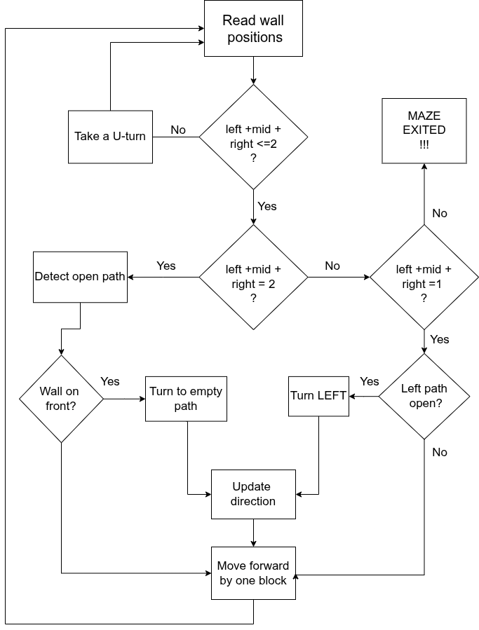

# The FINAL boss!

After configuring all our sensors and generating PWM signals, it's the right time to finally start building on the main algorithm that is supposed to be solving the maze! The journey is gonna be amazing, we promise!

There are quite a lot of tried and tested methods to solve a maze. To name a few, we have simple wall-following algorithms, search-based algorithms like Depth-First Search and Breadth-First-Search, path-planning based ones like A* or Djikstra's and the ones we like the most- Flood fill and Tremaux's algorithm. 

But here's the catch, we used none of them (LOL). Lemme be frank, we were first awed by the flood fill algorithm and made the arrays and wrote up the logic for updating values in the arrays as the bot traversed the maze, but it was highly expensive computationally and competition deadline constraints left us with little time for spending long hours on optimisation.

*(it's highly encouraged to explore all these algorithms and choose the one that works for you. For references, we'll add the ones we studied them from)*

So the plan changed. Our target now was to write a simple yet efficient algorithm for our bot to solve the maze. We had another constraint up our sleeves- the competition rules required us not to take the shortest path but to build an algorithm that visits as many of the dead ends as possible (8 did we manage to visit out the 9) and complete the whole exploration in a limit of 200 steps. The method we chose to achieve that was a simple rule: we receive data from the IR sensors about the presence of walls, then we continue making left turns unless there's a wall on the left. After a bit of tweaking the code to explore more deadends we successfully solved the maze in 116 steps!


Take a look at the following flowchart that provides a map of all the input and output signals from our main controller module:


Our main output signals would be connected to a motor driver module that controls the speed and direction of our wheels as directed by the controller. We used the simple and diy-bestie L298n motor driver for running our wheels. Controlling direction is fairly simple. You just gotta put the appropiate output signals from the main module to the motor driver INx pins to set the direction of rotation of the motors. And, here's a simple logic-flow to control the speed of the motors with PWM signals:


```verilog
if (counter == 400)  //we use a pwm frequency of 125 KHz 
    begin
    counter_pwm <= counter_pwm+1;
    if (counter_pwm == 255)begin
        counter_pwm <= 0;
    end

    counter <= 0;
    //set values of ena and enb accordingly to control speed
    //we kept the resolution 8-bit for familiarity to Arduino's analogWrite() function
    if(counter_pwm <= ena_pwm)begin
        ena <= 1;
    end else begin
        ena <= 0;
    end
    if(counter_pwm <= enb_pwm)begin
        enb <= 1;
    end else begin
        enb <= 0;
    end
end
```
As seen in the previous flowchart, we're also getting data about the distance from the walls from the ultrasonic sensor. We use this data to make another close-control loop to run the bot in the middle of the path and take turns with appropiate room available for next movements. Needs a little optimization with the distance and you'll be good to go! A little hack here to get an idea of the distances or cross-verify the readings is to map them to the 8- LED strip present in the De0 Nano FPGA (or any external indicator as you see fit). This is the mapping we did for debugging-

```verilog
leds[0] <= (dist_left  >= 25000);
leds[1] <= (dist_left  >= 30000);
leds[2] <= (dist_left  >= 15000);
leds[3] <= (dist_right >= 25000);
leds[4] <= (dist_right >= 30000);
leds[5] <= (dist_right >= 15000);
```

How do we make the turns? The wheels must rotate in different speeds to make the rotation possible. As for how to know when the turn has been completed, we count the encoder pulses till the start-to-end of the turn. You can obtain quite perfect 90 degree turns with some trial and error.
Here's an example left turn logic according to the values we had obtained:


```verilog
always @(posedge clk)begin
    if (ticks_m1_a <= 435 && ticks_m2_a <= 435) begin
        speed_l <= 130;
        speed_r <= 180;
    end
    
    else begin
        speed_l <= 0;
        speed_r <= 0;
        done <= 1;
    end
    
end
```

---

Let us now look at building up the the main Finite State Machine block that is responsible for the main decision making. Look at the following flowchart for understanding the decision-making rules. Just lemme give a little brief-up first: The first thing to look at is the sensor data telling us where the walls are. So we have a 3 input values to our module in the order left-mid-right. A value of "000" means we have successfully exited the maze and a value of "111" means we have hit a dead-end. Anything in between these values would require us to make decisions and take turns accordingly. The choice-making is simplest when the path is blocked on both sides and as per the plan, when there's two open paths, we take left turns wherever possible or keep moving forward otherwise. To keep track of the movements we also maintain a 2-bit variable that contains which side our bot is facing, mapped as "00" to North and rotates anticlockwise for the other directions.

A little hack here is to move the bot block-by-block since that worked best for us! You may play around with other possible approaches, for e.g. moving the bot as long as a wall is encountered. 



Finally, we have all the required data from our sensors and all the output signals ready to run the bot! You may take a look at the following case condition that corresponds to the logic of moving forward by one-block and try to understand how it all fits in and develop the full FSM to actually the drive the bot-

```verilog
FWD_ONEBLOCK : begin
    //done keeps track of the condition of moving into the next state
    if (done) begin
        next_state <= MEASURE;
        tick <= 1;
    end
    else begin
    // the ticks we calculated for moving forward by one block
        if((ticks_a + ticks_b) <= 2000)begin
            if(done == 0)begin
            //setting up the INx pins for both wheels to rotate in same direction
                in1 <= 1;
                in2 <= 0;
                in3 <= 0;
                in4 <= 1;
            end
            // maintaining a safe distance from the walls while we move
            if(infra_in[0] == 0 && infra_in[2] == 0)begin
                if(dist_left >= 2000 + dist_right)begin
                    ena_rm <= 110;
                    enb_rm <= 140;
                end else if(dist_right >= 2000 + dist_left)begin
                    ena_rm <= 140;
                    enb_rm <= 110;
                end else begin
                    ena_rm <= base_speed;
                    enb_rm <= base_speed;
                end
            end
            else if(infra_in[0] == 0)begin
                if(dist_left >= 27000)begin
                    ena_rm <= 110;
                    enb_rm <= 140;
                end else if(23000 >= dist_left)begin
                    ena_rm <= 140;
                    enb_rm <= 110;
                end else begin
                    ena_rm <= base_speed;
                    enb_rm <= base_speed;
                end
            end else if(infra_in[2] == 0)begin
                if(dist_right <= 23000)begin
                    ena_rm <= 110;
                    enb_rm <= 140;
                end else if(dist_right >= 27000)begin
                    ena_rm <= 140;
                    enb_rm <= 110;
                end else begin
                    ena_rm <= base_speed;
                    enb_rm <= base_speed;
                end
            end else begin
                ena_rm <= base_speed;
                enb_rm <= base_speed;
            end
        end 
        else begin
                ena_rm <= 0;
                enb_rm <= 0;
                in1 <= 0;
                in2 <= 0;
                in3 <= 0;
                in4 <= 0;
                done <= 1;
            end
        end
end
```

If you've read this far, THANK YOU! Our target was not to provide a ready-made Quartus Project File, but the idea behind building one from scratch, bit by bit. Hope you have gained more confidence in starting out with the real hardware now that you have read through the possible challenges. We have also attached further readings and references that you may take a look at.

We truly wish you all the best for trying out your own Maze-solver robot using a FPGA.

*Happy Debugging!*


