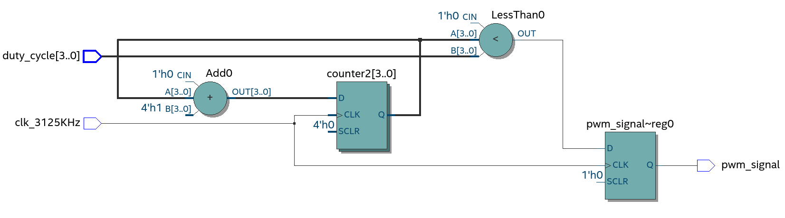

# Simple PWM Wave Generator from on-board Clock

Let's begin with, what are they? In simple terms, Pulse Width Modulation is a digital modulation technique in which the "on-time" of a square wave of a particular frequency is varied to carry on our information. The ratio of the "on-time" to its total time period is known as its Duty Cycle.

Now, we need 2 things to generate a PWM Signal:
- its duty cycle
- its frequency

Now your FPGA board has an on-board crystal oscillator that provides you with a clock of a certain frequency (50 MHz in our case). So you'd first want to have a frequency-divider that gives you any desired clock frequency to run your circuits, loops or read sensors.

### Frequency divider/scaler:
We define a module that takes our on-board clock as an input and gives us a scaled clock. Now, for the scaled frequency, it's best to choose an integer multiple of the input frequency. We then simply keep a counter and toggle the output when the counter overflows.

```verilog
//Generating 3125 KHz clock from 50MHz
reg [2:0]counter= 0;
always @ (posedge clk_50M) begin
    if (!counter) clk_3125KHz = ~clk_3125KHz; 
    counter = counter + 1'b1; 
end

```

### PWM Pulse Generation:
The PWM generator module builds on the frequency divider. We now keep a counter to keep a track of our duty cycle and toggle the output accordingly. Here you may choose a duty cycle resolution (i.e. dividing the time period into 2^n parts, for e.g. Arduino UNO uses an 8-bit resoltion) as per choice but keep in mind a higher resolution means a larger register is required to store the values of your counter. 
That's it. Clean and simple

```verilog
//Generating PWM signal with duty cycle as input
reg [3:0]counter = 0;
always @(posedge clk_3125KHz) begin
	
	counter <= counter + 1'b1;
	
		if (counter < duty_cycle) begin
			pwm_signal <= 1;
		end
		else begin
			pwm_signal <= 0;
		end
	end

```
The diagram below shows a synthesized module of frequency 3125KHz and takes the duty cycle as an input from user or any other module.  


This one shows the generation of a PWM signal of 195KHz frequency using a frequency divider module:

