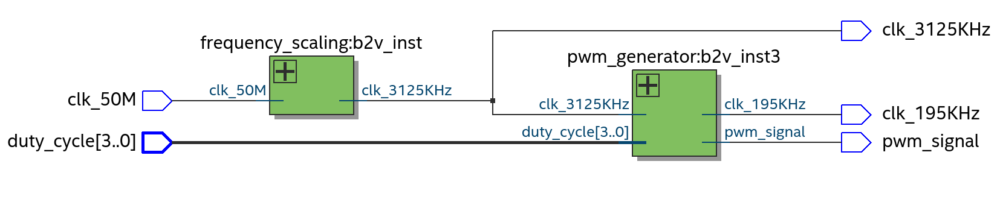

##Simple PWM Generator from on-board Clock

Let's begin with, what are they? In simple terms, Pulse Width Modulation is a digital modulation technique in which the "on-time" of a square wave of a particular frequency is varied to carry on our information. The ratio of the "on-time" to its total time period is known as its Duty Cycle.

Now, we need 2 things to generate a PWM Signal:
- its duty cycle
- its frequency

Now your FPGA board has an on-board crystal oscillator that provides you with a clock of a certain frequency (50 MHz in our case). So you'd first want to have a frequency-divider that gives you any desired clock frequency to run your circuits, loops or read sensors.

#### Frequency divider/scaler:
We define a module that takes our on-board clock as an input and gives us a scaled clock. Now, for the scaled frequency, it's best to choose an integer multiple of the input frequency. We then simply keep a counter and toggle the output when the counter overflows.

#### PWM Generation:
The PWM generator module builds on the frequency divider. We now keep another counter to keep a track of our duty cycle. Here you may choose a resolution as per choice but keep in mind a higher resolution means a larger register is required to store the values of your counter. 
That's it. Clean and simple

