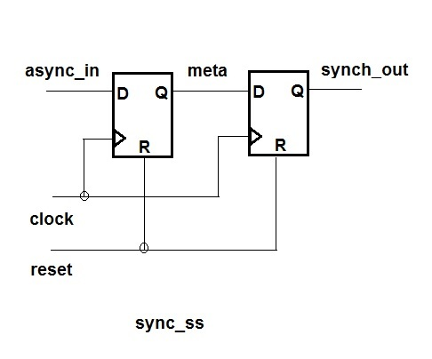
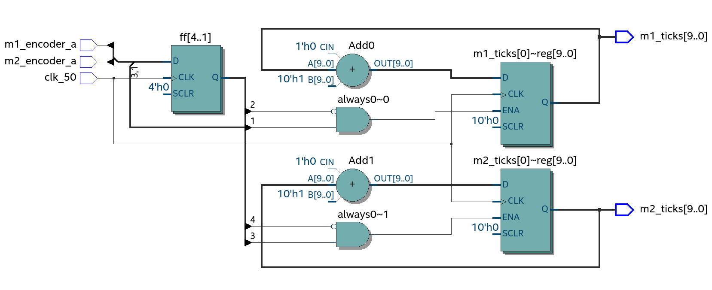
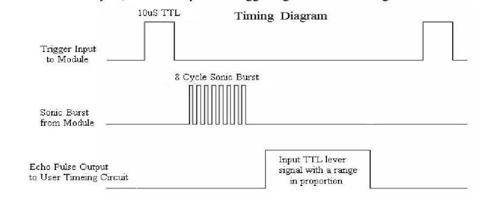

# Working with various sensors:

The bot needs to detect walls and also maintain a safe distance from them. Furthermore for implementing a closed-loop-control-system, we need to know exactly how much our wheels have actually moved compared to what we commanded. 

So, we use the following sensors:
- Infra-red obstacle detection sensor
- Ultrasonic sensor for distance measurement
- Wheel encoders for measuring distance travelled


### Infra-red sensors:
We use 3 IR senors placed in a star-configuration to detect walls on 3 sides and store the data in an array in the order of left-mid-right. The sensor outputs digital logic that reads a LOW when there's a wall and HIGH when the path is free. The proximity to the wall for detection can be adjusted using a potentiometer.

This module outputs the wall positions and is one of the most important ones (and the simplest of the sensors too) since we'll later base our maze-solving logic based on the presence of walls.


```verilog
//Reading the data and storing it in an array for future use
always @( posedge clk) begin
		  is_wall[0] <= infra[0];
		  is_wall[1] <= infra[1];
		  is_wall[2] <= infra[2];
    end

```

### Reading encoders:

Things get a bit tougher here. Let's first understand what and why. 
An encoder sends the controller a certain number of pulses during the time we are meausring. We rotate the wheel by hand first and count the number of pulses generated for a single rotation and then we can easily calculate the rotation speed from the number of pulses we received and the time period of observation.

But the method is very much dependent on accurately measuring the pulses. So, how does one ensure none of them are missed? We use what is called an interrupt- a method where the controller stops all its ongoing functions when an encoder pulse is received, runs a special function at that time (which is called an Interrupt Service Routine) which let's say increments a counter that stores the current pulse value. Perfect!

Well, not really. The problem lies in understanding how a procedural block works in Verilog. Clock is an important parameter in a sequential logic circuit. The way outputs change depend on which clock configuration we choose to read the inputs and trigger changes in the output accordingly. The "always" block showm below does this at every positive edge or rising clock edge i.e. when the clock pulse changes from LOW to HIGH. Now, our interrupt signal is not synchronous with our clock. This is termed as clock-domain-crossing- when a signal is asynchronous with our clock and brings up a "meta-stable" state where the output is not a stable 1 or 0. If the pulse is received near about the time when the clock is changing as well, there's a fair chance we might not read it at all. 

OK. Lot's of jargon. How do we tackle it then? That's much simpler- just hold on to the encoder pulse for one more clock pulse to make sure it is read by your controller. So, we store it in a flip-flop (1 bit register). That solves the problem of receiving the pulse.

The next challenge is to actually implement an interrupt. How do we confirm a change has occured in the encoder reading and change our counter variable based on that? We need to use a 2nd flip-flop for that. The first flip-flop directly stores the data from the encoder while the 2nd one holds on to the previous value read from the encoder. In this way we can detect a change in readings and be sure that a pulse had indeed been generated. 

The example below does it by detecting falling edges in the encoder pulse. Play around with it and try writing conditions for detecting rising edges or keeping track of both rising or falling edges (think about Arduino attachInterrupt function)

```verilog

always @(posedge clk_50)begin
        ff1 <= m1_encoder_a;
        ff2 <= ff1;

        if (ff1 == 1 && ff2 == 0)begin
            m1_ticks <= m1_ticks + 1;
        end        
    end
```

The diagram shows a typical synchronisation circuitry.


*Image credit: https://daffy1108.wordpress.com/2014/06/08/synchronizers-for-asynchronous-signals/*


A synthesised module reading data from both wheel encoders and gives the encoder ticks as output for use by other modules.



### Ultrasonic Sensors:

We are using the HC-SR04 sensor module. The first step here is to have a look at the datasheet, specially at the timing diagram and see exactly how it is supposed to work. 



*Image credit: https://cdn.sparkfun.com/datasheets/Sensors/Proximity/HCSR04.pdf*

What we see is that it requires a short 10-uS trigger pulse to start the ranging. Then the module sends an 8-cycle burst of ultrasonic pulses at 40KHz and keeps waiting for the echo to arrive. We are going to achieve this operation by implementing what is called a Finite State Machine. 
It consists of multiple states that perform discrete actions one after another in an orderly manner. Each state has its own function and a logical conditioning for transitioning to a next-state. 

In the following snippet we initialise the variables for our module.Note that we keep a buffer time of 25mS to wait for the echo pulse to arrive and start calculating the distance. The module takes clock signal input, a start input to enable the module and start its functioning, a trigger output mapped to the TRIG pin of the sensor and an input echo mapped to the ECHO pin of the sensor. The measurement would be noisy and you may apply a low-pass-filter to get more accurate results.

```verilog

parameter 	clk_mhz = 50,					
            trig_ms = 10,  	
            timeout_ms = 25;

localparam	count_trig_pulse = clk_mhz * trig_ms;
localparam  count_timeout = clk_mhz * timeout_ms * 1000;

reg [20:0] counter;
reg[2:0]  state, state_next;

```
A conversion guide for getting the distances would be as per the following formulae:

$$
d = \frac{v \cdot t}{2}
$$

where:

- \( d \) = distance
- \( v \) = speed of sound
- \( t \) = time for which the echo pulse remains HIGH

Considering the speed of sound:

$$
v = 343 \text{ m/s} = 34300 \text{ cm/s}
$$

Thus,

$$
d_{cm} = \frac{34300 \cdot t}{2}
$$

For practical implementation, time is usually measured in microseconds:

$$
d_{cm} = \frac{t_{\mu s}}{58}
$$

For implementation using a 50 MHz clock:

$$
t = \frac{N}{50 \times 10^6}
$$

where, N = number of clock cycles for which ECHO remains HIGH

Substituting this into the distance equation:

$$
d = \frac{343 \cdot N}{2 \cdot 50 \times 10^6}
$$

Approximating in centimeters:

$$
d_{cm} \approx \frac{N}{2915}
$$

For simpler hardware implementation, this is often approximated as:

$$
\mathrm{distance}_{cm} = \frac{\mathtt{echo\_count}}{2900}
$$

The FSM state transitions are as follows:

```verilog

always @(*) begin
    state_next <= state; 
    echo_prev = echo;

    case (state)
        IDLE: begin 
            if (start) state_next <= TRIG;
        end
        
        TRIG: begin 
            if (counter >= count_trig_pulse) state_next <= WAIT_ECHO_UP;
        end
        
        WAIT_ECHO_UP: begin
            if (echo) state_next <= MEASUREMENT;
        end
        
        MEASUREMENT: begin
            if (echo) begin
                    echo_counter <= echo_counter + 1;
                    end
            else if (!echo && echo_prev) begin
                    distance_out <= echo_counter/ 2915;

                    if ((echo_counter * 34) / 10000  <= dist_threshold)
                        op <= 1;
                    else
                        op <= 0;
                    state <= WAIT;
                end   
        end
        
        MEASURE_OK: begin
            state_next <= IDLE;			
        end

        default: begin
            state_next <= IDLE;
        end	
    endcase
    
end

```
It took us quite sometime to get the ultrasonic sensor data right because of the timing intricacies. We hope the snippets have given you a better idea on how the sensor works and how to read the distance from it. Have fun!

